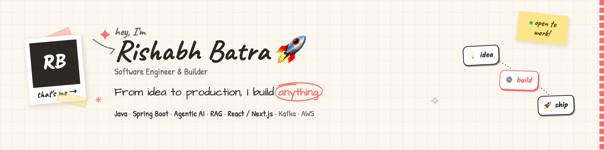
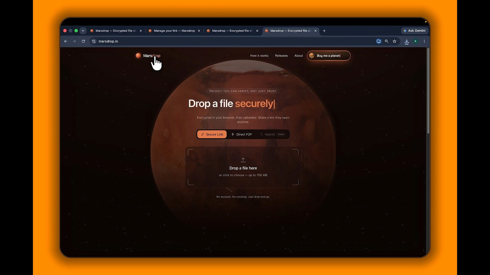
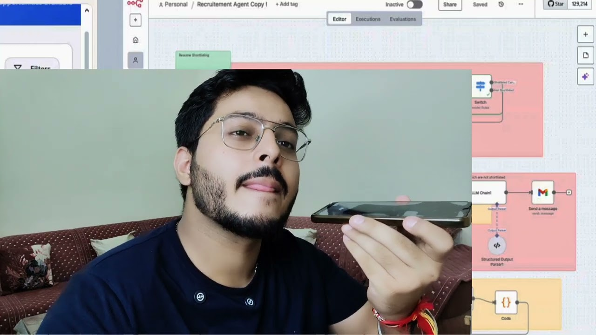
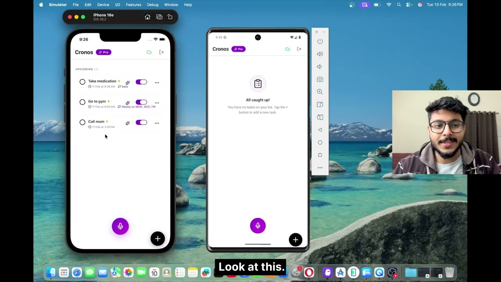
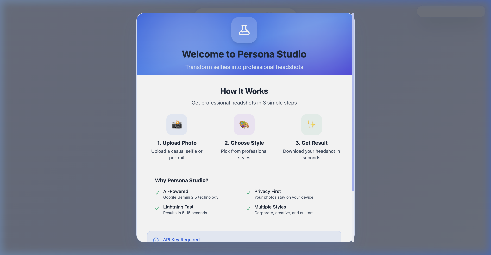
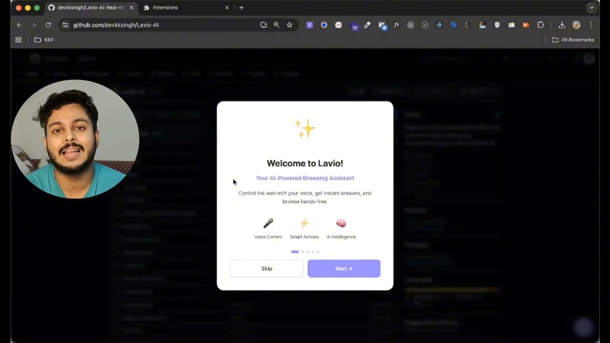
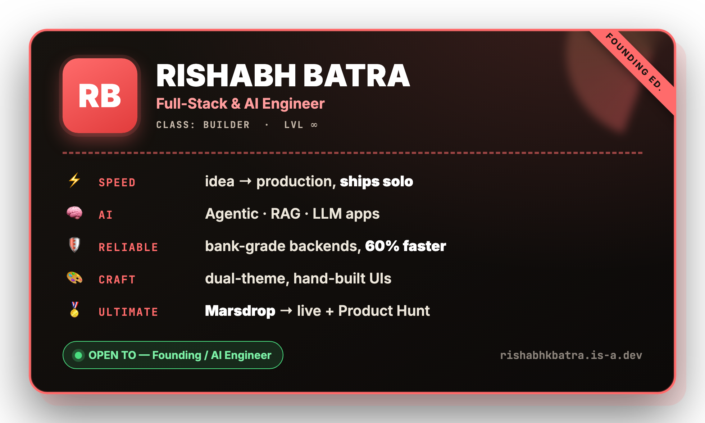

<!-- ==================== HERO (theme-aware: sketch on light, neobrutalism on dark) ==================== -->
<!-- Mirrors my portfolio's "two themes, one codebase". GitHub picks the banner from the
     viewer's theme. Assets: banner.gif (dark, animated) + banner-sketch.png (light). -->

  <picture>
    <source media="(prefers-color-scheme: dark)" srcset="./assets/banner.gif" />
    <source media="(prefers-color-scheme: light)" srcset="./assets/banner-sketch.png" />
    
  </picture>

<!-- ==================== TYPING INTRO ==================== -->

  

<!-- ==================== SOCIAL BADGES ==================== -->

  
  
  
  
  
   
  

 

<!-- ==================== ABOUT ==================== -->
## 🚀 Hey, I'm Rishabh — a builder.

I take products from an **empty repo to live in production**. Backend, AI, full-stack — whatever the idea needs. I bring **ex-fintech reliability** to **startup speed**.

- 🔭 &nbsp;Building at the **AI × product** frontier — agentic systems, RAG pipelines & LLM apps
- 🏦 &nbsp;4+ years shipping **bank-grade** backends — real-time trading, reactive microservices, 60% latency cut
- 🧩 &nbsp;Shipped **[Marsdrop](https://marsdrop.in)** end-to-end — zero-knowledge encrypted file sharing, live & on Product Hunt
- 🌱 &nbsp;Founding-engineer energy: high ownership, ship weekly, sweat the details users feel but never see
- 💬 &nbsp;Open to **Founding / AI Engineer** roles — *let's build something worth shipping*
- 🌐 &nbsp;Explore everything at **[rishabhkbatra.is-a.dev](https://rishabhkbatra.is-a.dev)**

   
  <code>⚡ 60% latency cut</code> &nbsp; <code>✅ 85%+ test coverage</code> &nbsp; <code>🧑‍💻 3+ yrs in production</code> &nbsp; <code>🏅 Product Hunt launch</code>

<!-- ==================== TECH STACK ==================== -->
## 🛠️ Tech Stack

   
  <b>Languages</b>  
  
  
  
  
  
    
  <b>Backend &amp; Messaging</b>  
  
  
  
  
  
    
  <b>AI / LLM</b>  
  
  
  
  
  
    
  <b>Frontend</b>  
  
  
  
    
  <b>Data &amp; DevOps</b>  
  
  
  
  
  
  
  
  

<!-- ==================== FEATURED PROJECTS ==================== -->
## ✨ Featured Projects

<!-- Flagship — full-width thumbnail + write-up -->
<table>
  <tr>
    <td width="46%" valign="top">
      
    </td>
    <td width="54%" valign="top">
      <h3>🪐 Marsdrop &nbsp;<i>flagship</i></h3>
      <b>Zero-knowledge encrypted file sharing</b>, built &amp; launched end-to-end. Client-side streaming <b>AES-256-GCM</b> keeps the key in the URL fragment — the server only ever stores a blob it <i>can't read</i>. Files self-destruct on expiry / limit / revoke, with optional <b>WebRTC P2P</b> transfer signalled by a Cloudflare Durable Object.
        
      <code>Next.js</code> <code>Web Crypto</code> <code>WebRTC</code> <code>Cloudflare</code> <code>Supabase</code>
        
      
      
      
    </td>
  </tr>
</table>

<!-- 2×2 gallery — the rest -->
<table>
  <tr>
    <td width="50%" valign="top">
      
      <h4>🤖 AI Recruitment Automation</h4>
      End-to-end hiring platform — resume parsing, dual portals &amp; AI voice interviews. <b>Cut manual screening 85%.</b>
        
      <code>n8n</code> <code>ElevenLabs</code> <code>Gemini</code> <code>React</code>
        
      
    </td>
    <td width="50%" valign="top">
      
      <h4>🎙️ Cronos AI Reminder &nbsp;<i>hackathon</i></h4>
      Offline-first AI reminder app with bidirectional sync, voice transcription &amp; scheduling NLP.
        
      <code>React Native</code> <code>Whisper</code> <code>GPT-4o-mini</code> <code>Supabase</code>
        
      
      
    </td>
  </tr>
  <tr>
    <td width="50%" valign="top">
      
      <h4>🖼️ Persona Studio</h4>
      Privacy-first AI headshot generator — client-side processing, Gemini 2.5, results in 5–15s.
        
      <code>React 19</code> <code>TypeScript</code> <code>Vite</code> <code>Gemini</code>
        
      
    </td>
    <td width="50%" valign="top">
      
      <h4>🧭 Lavio Browser Engine &nbsp;<i>hackathon</i></h4>
      Voice-powered AI browser extension automating in-browser workflows, hands-free.
        
      <code>JavaScript</code> <code>Chrome Extensions</code> <code>Ollama</code>
        
      
      
    </td>
  </tr>
</table>

  

<!-- ==================== DEV TRADING CARD ==================== -->

  

<!-- ==================== CURRENTLY BUILDING ==================== -->
## 🔨 Currently Building &amp; Exploring

<table>
  <tr>
    <td width="50%" valign="top">
      <h3>🔨 Now</h3>
      <ul>
        <li>Agentic AI tools &amp; LLM-powered products</li>
        <li>Shipping side projects <b>0 → 1</b>, live on the web</li>
        <li>Turning my portfolio's ideas into real, usable apps</li>
      </ul>
    </td>
    <td width="50%" valign="top">
      <h3>🌱 Going Deep On</h3>
      <ul>
        <li>RAG, evals &amp; agent orchestration</li>
        <li>Realtime, reactive backends at scale</li>
        <li>Product craft — the details users feel but never see</li>
      </ul>
    </td>
  </tr>
</table>

  <i>Building something ambitious and looking for a founding / AI engineer? <a href="mailto:rishabhbatra81@gmail.com">Let's talk →</a></i>

<!-- ==================== CONNECT ==================== -->
## 🤝 Let's build something

I'm always up for a conversation about **AI products**, **backend systems**, or **0→1 startups**. If you're a founder building something ambitious — reach out.

  
  
  
  

 

  <i>From idea to production — let's build something worth shipping.</i> 🚀

